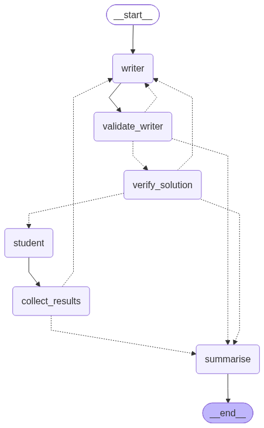

# Physics Problem Writer

A multi-agent system that generates graduate-level physics exam problems with adaptive difficulty. A **writer** agent creates problems from LaTeX lecture notes, **student** agents attempt to solve them in parallel, and the system iteratively hardens the problem until it stumps enough students.

## How It Works

The system runs an iterative loop using LangGraph:

1. **Writer** reads your LaTeX notes (summarised into a concept index) and generates a self-contained physics problem with a numeric answer.
2. **Verifier** independently re-solves the problem to check the writer's solution is correct.
3. **Students** (configurable count, each with slightly different temperature) attempt the problem in parallel.
4. **Collector** tallies correct/incorrect answers.
5. **Router** decides:
   - If too many students got it right, the writer is shown the student attempts and asked to harden the problem. Loop back to step 1.
   - If few enough students got it right (or the round cap is hit), stop and summarise.

The writer uses targeted hardening techniques based on diagnosing *how* students failed (wrong approach, missed insight, wrong formula, gave up, or problem was too mechanical).

### Architecture



| Node | Role |
|------|------|
| **writer** | Reads the summarised notes (and previous round feedback, if any) and generates a new physics problem with a full solution and numeric reference answer. |
| **validate_writer** | Checks the writer's output is well-formed — non-blank context, valid answer, not a trivial forbidden value (0, 1, -1). Routes back to the writer on failure (up to 3 retries) or forward to verification. |
| **verify_solution** | An independent LLM call re-derives the answer from scratch to catch errors in the writer's solution. If it disagrees, the problem is rejected and the writer retries. |
| **student** | N parallel instances (one per student agent) each attempt the problem at slightly different temperatures. Each returns its reasoning and final numeric answer. |
| **collect_results** | Gathers all student answers, scores them against the reference answer, logs the round to `all_problems.txt`, and records the round summary for the routing decision. |
| **summarise** | Writes the final session report (`summary.txt`) with stop reason, model info, and a per-round scoreboard. Terminates the graph. |

## Setup

### Requirements

- Python 3.10+
- An OpenAI API key

### Installation

```bash
pip install -r requirements.txt
```

### Environment

Create a `.env` file in the project root (or export the variable):

```bash
OPENAI_API_KEY=sk-...
```

## Usage

```bash
python physics_writer_agent.py <NOTES_DIR> [OPTIONS]
```

### Arguments

| Argument | Flag | Default | Description |
|----------|------|---------|-------------|
| `directories` | positional | *(required)* | One or more directories containing `.tex`/`.latex` files |
| `--students` | `-s` | 8 | Number of parallel student agents per round |
| `--max-correct` | `-c` | 2 | Stop when this many or fewer students answer correctly |
| `--rounds` | `-r` | 6 | Maximum number of problem iterations |
| `--output` | `-o` | `.` | Directory for output files |
| `--summary-dir` | `-d` | `.` | Directory for the notes summary cache |
| `--writer-model` | `-m` | `gpt-4o` | OpenAI model for the writer/verifier/summariser |
| `--student-model` | `-M` | `gpt-4o` | OpenAI model for student agents |
| `--reviewer-samples` | `-R` | 4 | How many student attempts the writer reviews each round |
| `--reasoning-chars` | `-C` | 2000 | Max characters of each student's reasoning sent to writer |
| `--writer-temp` | `-t` | 0.7 | Temperature for writer/verifier/summariser |

### Example

```bash
python physics_writer_agent.py \
    notes/superluminal-bh/ \
    --students 5 \
    --max-correct 1 \
    --rounds 5 \
    --output results/run-1/ \
    --summary-dir results/run-1/summary \
    --writer-model gpt-4o \
    --student-model gpt-4o
```

## Output

The system produces three files in the output directory:

| File | Contents |
|------|----------|
| `all_problems.txt` | Every problem generated across all rounds, with context, question, solution, answer, and a per-student correct/incorrect bar |
| `student_responses.txt` | Full reasoning traces from every student on every round |
| `summary.txt` | Session summary showing stop reason, models used, and a compact scoreboard for each round |

A notes summary cache (`notes_summary_<hash>.txt`) is saved in the summary directory. Subsequent runs with the same unchanged notes skip the summarisation LLM calls.

### Example summary output

```
Stopped because : problem stumped enough students (0 ≤ 1 correct out of 5)
Total rounds    : 3
Writer model    : gpt-4o
Student model   : gpt-4o
Students        : 5
Stop threshold  : ≤ 1 correct

  Round  1  ans=   170  ✓✓✓✗✗  correct=3
  Round  2  ans=    85  ✗✓✗✓✗  correct=2
  Round  3  ans=   267  ✗✗✗✗✗  correct=0
```
